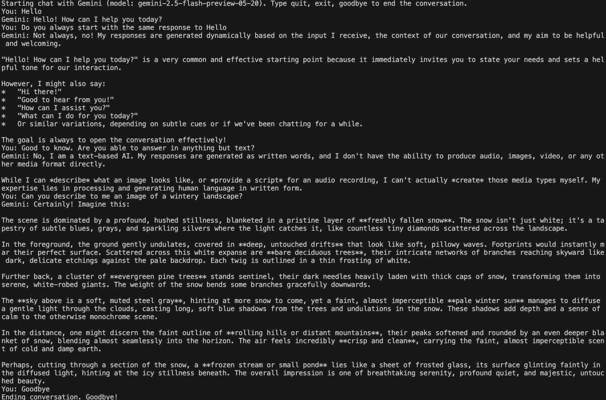

# Terminal based conversation/chat with Gemini

Example conversation:

## Requirements

- Node.js
- Get API key from https://aistudio.google.com/apikey and save it in a file called .env, in the following format: API_KEY=YOUR_PERSONAL_KEY_VALUE
- Install npm dependencies: `npm install`

## How to start the chat

`node ./gemini-conversation.js`

## How to end the chat

- Type 'quit', 'exit', 'stop', 'goodbye' or 'bye' to end the conversation.
- CTRL + C
- Customise the code to consider other exit words (see the const exitWords)
